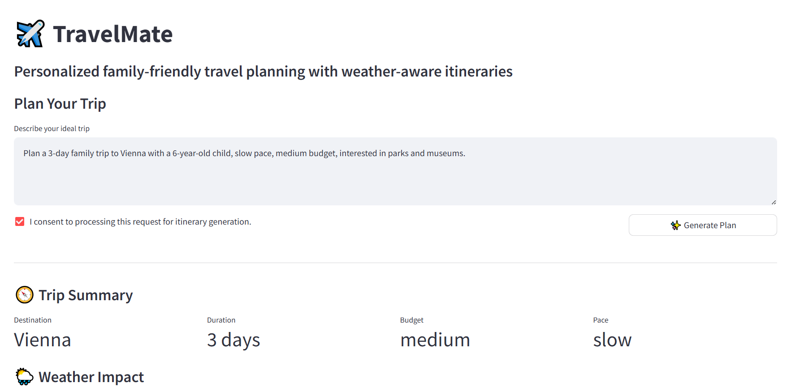
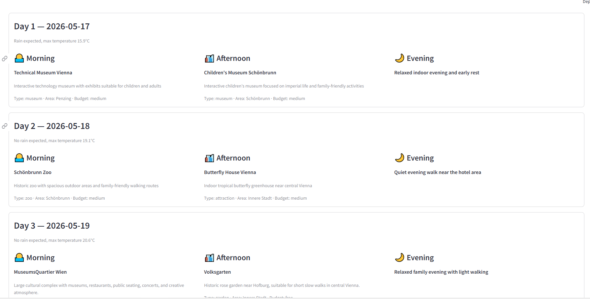
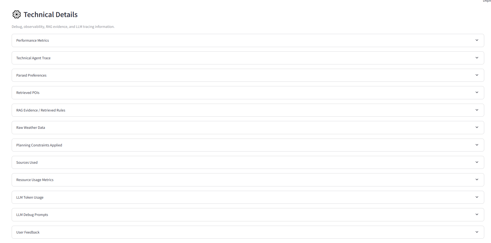

# README

# TravelMate — Multi-Agent Family-Friendly Travel Planner

TravelMate is an AI-powered multi-agent travel planning assistant that creates realistic family-friendly itineraries using Retrieval-Augmented Generation (RAG), live weather integration through MCP, and rule-based itinerary validation.

The system combines curated travel knowledge, weather conditions, travel pacing, budget constraints, seasonality, and family-specific travel rules to generate practical day-by-day travel plans instead of generic attraction lists.

---

# Project Goals

Travel planning for families is more complex than simply selecting popular attractions. Travelers need to balance:

- weather conditions;
- seasonality;
- indoor/outdoor activities;
- child fatigue;
- realistic pacing;
- budget limitations;
- travel preferences.

Most generic travel assistants generate attraction lists but do not produce realistic itineraries suitable for families with children.

TravelMate addresses this problem through a modular multi-agent architecture combining:

- structured preference extraction;
- RAG-based travel knowledge retrieval;
- live weather integration;
- itinerary validation and revision;
- source attribution and observability.

---

# Key Features

- Multi-agent travel planning workflow
- Multi-city RAG knowledge base
- Live weather integration via MCP + Open-Meteo
- Family-friendly itinerary generation
- Budget-aware and pace-aware recommendations
- Seasonality-aware planning
- Travel rules validation and revision loop
- Source attribution and retrieval traceability
- Observability and agent tracing
- Automated positive, negative, and adversarial tests
- Streamlit interactive UI

---

## UI Preview







---

# Example User Request

> “Plan a 3-day trip to Prague with a 4-year-old child, slow pace, medium budget, interested in parks, museums, and old town walks.”
> 

The system returns:

- parsed travel preferences;
- retrieved POIs from the RAG knowledge base;
- weather-aware recommendations;
- realistic day-by-day itinerary;
- indoor alternatives for rainy weather;
- warnings and planning trade-offs;
- source attribution and agent trace.

---

# High-Level Architecture

```markdown
User
↓
Streamlit UI
↓
Travel Orchestrator
↓
Preference Agent
↓
Location Agent
(RAG Knowledge Base)
↓
Weather Agent
(MCP / Open-Meteo)
↓
Itinerary Agent
(Travel Patterns RAG)
↓
Constraint Checker Agent
(Travel Rules RAG)
↓
revision needed?
├── yes → Itinerary Agent
└── no
↓
Synthesis Agent
↓
Final Response + Sources + Warnings
```

For detailed architecture decisions and rationale, see:

- `docs/Architecture_Blueprint.md`
- `docs/Self_Review.md`

---

# Agent Overview

## Preference Agent

Extracts and normalizes travel preferences from natural language user input.

## Location Agent

Retrieves relevant POIs and city context from the RAG knowledge base.

## Weather Agent

Retrieves live weather data through an MCP-based weather integration.

## Itinerary Agent

Builds the initial day-by-day itinerary using travel patterns, weather, budget, and pacing logic.

## Constraint Checker Agent

Validates the itinerary using retrieved travel rules and family constraints.

## Synthesis Agent

Generates the final user-facing itinerary with warnings, explanations, and source attribution.

---

# Technology Stack

| Layer | Technology |
| --- | --- |
| UI | Streamlit |
| Language | Python |
| Orchestration | Custom Python orchestrator |
| LLM | OpenAI GPT models |
| RAG | Chroma persistent vector store |
| Embeddings | OpenAI `text-embedding-3-small` |
| MCP | MCP weather server (stdio transport) |
| External API | Open-Meteo |
| Tests | Pytest |
| Observability | Structured logs + agent trace |
| Monitoring | psutil |

---

# Project Structure

```
travelmate/
├── agents/
├── app/
├── data/
│   └── knowledge_base/
│       ├── prague/
│       ├── vienna/
│       ├── barcelona/
│       └── travel_rules/
├── mcp_servers/
├── mcp_tools/
├── models/
├── orchestrator/
├── services/
├── tests/
└── vector_store/
```

---

# RAG Knowledge Base

The system uses curated local travel datasets.

## Included Cities

- Prague
- Vienna
- Barcelona

## Knowledge Sources

### City Guides

Narrative travel information and travel logic.

### POI Datasets

Structured travel locations with metadata:

- indoor/outdoor;
- budget level;
- family suitability;
- duration;
- tags.

### Travel Rules

Travel planning heuristics:

- family pacing;
- weather substitutions;
- budget rules;
- seasonality logic.

### Sample Itineraries

Example itinerary patterns used during itinerary generation.

---

# MCP Weather Integration

TravelMate uses a dedicated MCP weather server to retrieve live weather conditions from Open-Meteo.

```
Weather Agent
 ↓
MCP Weather Server
 ↓
Open-Meteo API
```

Weather conditions influence:

- indoor/outdoor activity selection;
- rainy day substitutions;
- seasonality-aware planning;
- pacing adjustments.

---

# Observability & Monitoring

The system includes:

- agent execution trace;
- latency tracking;
- token usage tracking;
- structured JSON logs;
- CPU and memory monitoring;
- request metrics;
- user feedback collection;
- audit logs.

---

# Security & Safety

Implemented MVP-level protections:

- input sanitization;
- harmful content filtering;
- basic prompt injection checks;
- PII anonymization;
- session-based rate limiting;
- graceful API fallback handling;
- `.env`based secret management.

---

# Setup Instructions

## 1. Clone Repository

```
git clone <repository_url>
cd <repository_name>
```

---

## 2. Create Virtual Environment

### Windows

```
python -m venv venv
venv\\Scripts\\activate
```

### Linux / macOS

```
python3-m venv venv
source venv/bin/activate
```

---

## 3. Install Dependencies

```
pip install -r requirements.txt
```

---

## 4. Configure Environment Variables

Create `.env` file:

```
OPENAI_API_KEY=your_openai_api_key
APP_PASSWORD=your_demo_password
```

Example template is provided in `.env.example`.

---

# Build RAG Knowledge Base

The vector store must be initialized before first use.

Run:

```
python -m travelmate.scripts.build_index
```

This builds the persistent Chroma vector database from the local knowledge base.

---

# Run Application

```
python -m streamlit run travelmate/app/streamlit_app.py
```

---

# Run Tests

Run all tests:

```
python -m pytest travelmate/tests
```

---

# Example Test Categories

## Positive Tests

- Happy-path family trip
- Weather-aware planning
- Budget-aware itinerary generation

## Negative Tests

- Unsupported city handling
- Overloaded itinerary detection
- Weather fallback handling

## Adversarial Tests

- Prompt injection attempts
- Unsupported hallucination requests
- Unsafe instruction overrides

---

# Demo Scenarios

## Scenario 1 — Happy Path

Family-friendly Prague itinerary with weather-aware recommendations.

## Scenario 2 — Overloaded Trip

The system reduces unrealistic activity density.

## Scenario 3 — Rainy Weather

Indoor alternatives are prioritized.

## Scenario 4 — Adversarial Prompt

The system rejects unsafe override attempts and remains grounded in retrieved sources.

---

# Key Technical Decisions

- Custom Python orchestrator for transparent execution flow and easier testing
- Chroma persistent vector store for lightweight local RAG
- Streamlit for rapid MVP development and observability visualization
- Curated datasets for reliable retrieval and demo stability
- MCP weather integration to demonstrate external tool usage

Detailed rationale is described in:

- `docs/Architecture_Blueprint.md`
- `docs/Self_Review.md`

---

# Trade-Offs & Limitations

## Current MVP Limitations

- No hotel or ticket booking
- No exact transport routing
- No real-time opening hours
- Simplified itinerary optimization
- Simplified authentication system
- Simplified weather-aware itinerary adaptation logic

## RAG Limitations

RAG quality is validated through targeted tests and source-grounding checks rather than full production-scale precision/recall evaluation.

## Security Limitations

Authentication and rate limiting are implemented at MVP/demo level.

---

# Future Improvements

Possible future extensions:

- Telegram bot frontend
- FastAPI API layer
- Advanced hourly weather-aware itinerary optimization
- Parallel agent execution
- Advanced route optimization
- Additional cities and travel domains
- More advanced hallucination grounding and verification
- Production-grade authentication

---

# Test Results

Current automated test suite includes:

- positive tests;
- edge-case tests;
- adversarial prompt tests;
- concurrency tests;
- RAG quality tests;
- MCP fallback tests.

---

# Documentation

Included deliverables:

- Architecture Blueprint
- Executive Summary
- Self-Review
- Test Suite
- README
- Video Demo

---

# Video Demo

Video link:

https://youtu.be/q9CJzIz-S7c

---

# Author

Marina Safronova

EPAM GenAI Capstone Project